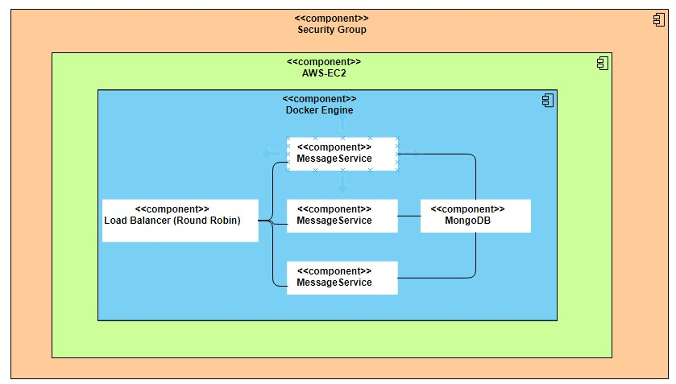
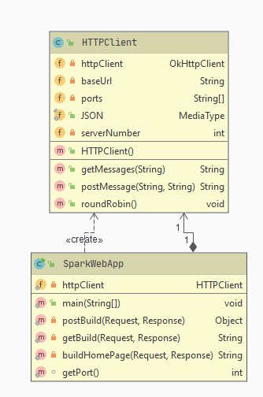
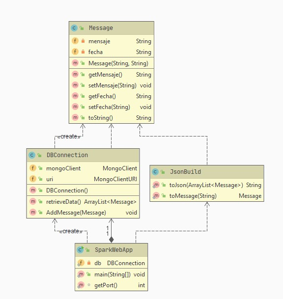
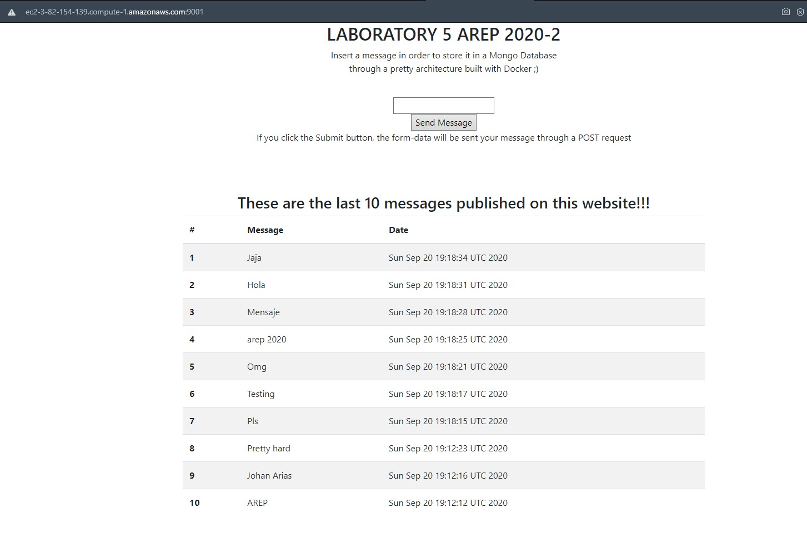
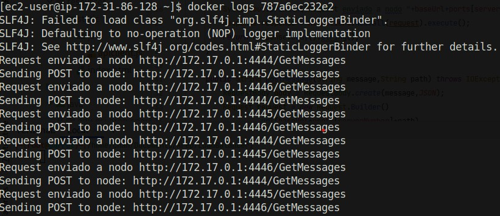
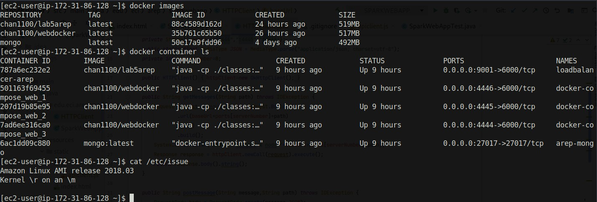

# Modularization Workshop with Virtualization and Introduction to Docker and AWS

## Description

  This workshop consists in creating an architecture that contains a load balancer,
  3 nodes that handle REST requests and a node that contains a mongo database.
  Each node represents a container in Docker.
 
## Design 

  This is the intended design for this project
  
  
 
## CI/CD 

This project has continuos integration via 

**CircleCi LoadBalancer** [](https://app.circleci.com/pipelines/github/JohanS11/LoadBalancer)

**CircleCi RESTServer** [](https://app.circleci.com/pipelines/github/JohanS11/RESTServer)

    
### Class Diagram
  
  **Load Balancer**
  
  
  
  **REST Server**
  
  
  
  
## User's guide

  This is the guide that will setup this proyect at your local machine in order to be able to run it.
  
  ### Prerequisites
  
  It is necessary having these tools installed on your computer:
  
  * Docker
  * Docker-compose
  * Git
 
  ### Setting up this project at your local machine

1. **Download these docker images**

```sh
  $ docker pull chan1100/lab5arep
  $ docker pull chan1100/webdocker
```
  
2. **Clone this repository:** 

```sh
  $ git clone https://github.com/JohanS11/LAB5Arep.git 
```

3. **Go to the docker-compose directory**

 ```sh
  $ cd docker-compose
```

4. **Execute the docker-compose.yml file**

 ```sh
  $ docker-compose up -d --scale web=3
```

5. **Now you should be able to see this project at http://ec2-3-82-154-139.compute-1.amazonaws.com:9001/?data=4**

 ### Architecture Description

   You can find the architecture description of this project at [Architecture Description](https://github.com/JohanS11/LAB5Arep/blob/master/LAB5Arep.pdf)

   ### Testing the application
   
   ***Web App running on AWS with the describedarchitecture ***
   
   
   
   
   ***Load Balancing logs***
   
   
   
   ***docker images and docker container ls on the EC2 instance***
   
   
       
  ## This project was built with:
  
   - Apache Maven 3.6.3
   - Docker 
   - Spark web
   - Java 1.8.0_211
   - Git 2.26.2
   - AWS (EC2)
   
  ## Docker Cheat Sheet
  
  ***List all containers***
  
 ```sh
  $ docker container ls 
  $ docker ps -a (List all containers not just running)
```

***List all images***
  
  ```sh
  $ docker images  
```

***Build an image from the Dockerfile***
  
  ```sh
  $ docker build -t <myimage> 
```
***Run a container***

  ```sh
  $ docker run -d -p <localport>:<containerport> --name firstdockercontainer <image> 
```
***Run a docker-compose with 3 instances of web***

```sh
  $ docker-compose up -d --scale web=3
```

***Get a shell into the container***

```sh
  $ docker exec -it <docker ID> /bin/bash
```
[Here is a batch scrip to reset all the stuff :=)](https://github.com/JohanS11/LAB5Arep/blob/master/docker-compose/docker-reset.sh)
  
   
  ## Author
  
  Johan Sebastian Arias Amador ([JohanS11](https://github.com/JohanS11))
  
  ## License
  
  This project is licensed under the GNU General Public License v3.0 - see the [LICENSE](https://github.com/JohanS11/LAB2-AREP/blob/master/LICENSE) file for more details.
